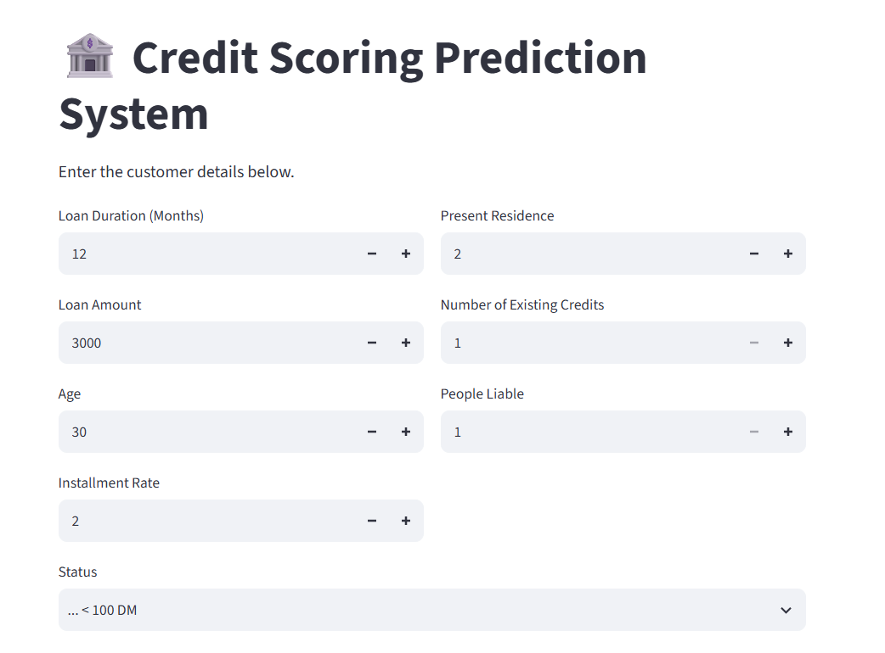
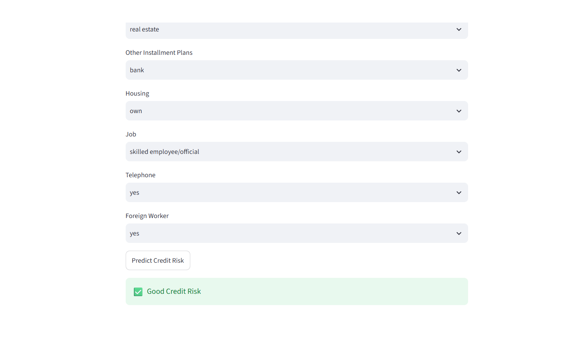
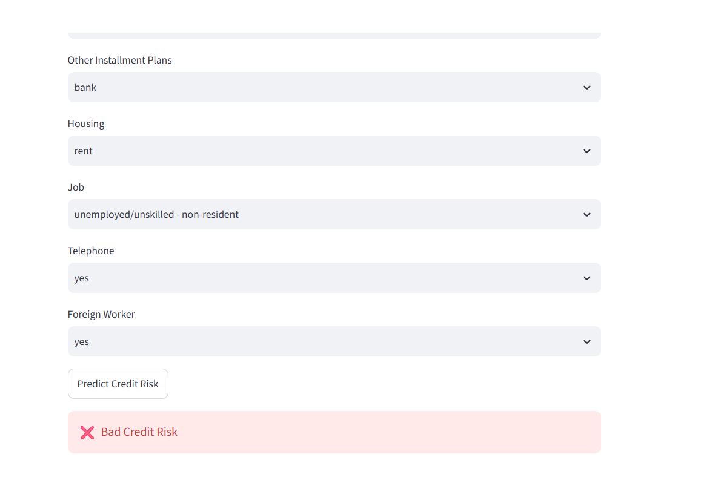

# 🏦 Credit Scoring Prediction System

A Machine Learning web application that predicts whether a customer has a **Good Credit Risk** or **Bad Credit Risk** using the German Credit Dataset.

## 🚀 Live Demo

🔗 https://codealphacreditscoringmodelgit-4cvzyqznegeybw6xofradn.streamlit.app/

## ✨ Features

- Predicts Good or Bad Credit Risk
- Interactive Streamlit interface
- Random Forest Classifier
- Real-time prediction

## 🛠️ Tech Stack

- Python
- Pandas
- NumPy
- Scikit-learn
- Streamlit
- Joblib

## 📸 Screenshots

### Home Page



### Good Credit Risk Prediction



### Bad Credit Risk Prediction



## ⚙️ Installation

```bash
git clone https://github.com/<YOUR_GITHUB_USERNAME>/CodeAlpha_CreditScoringModel.git

cd CodeAlpha_CreditScoringModel

pip install -r requirements.txt

streamlit run src/app.py
```

## 📊 Model Used

- Random Forest Classifier

## 👩‍💻 Author

**Sakshta Patil**
